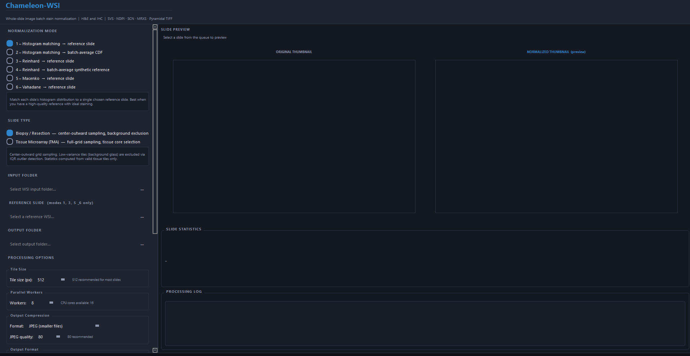
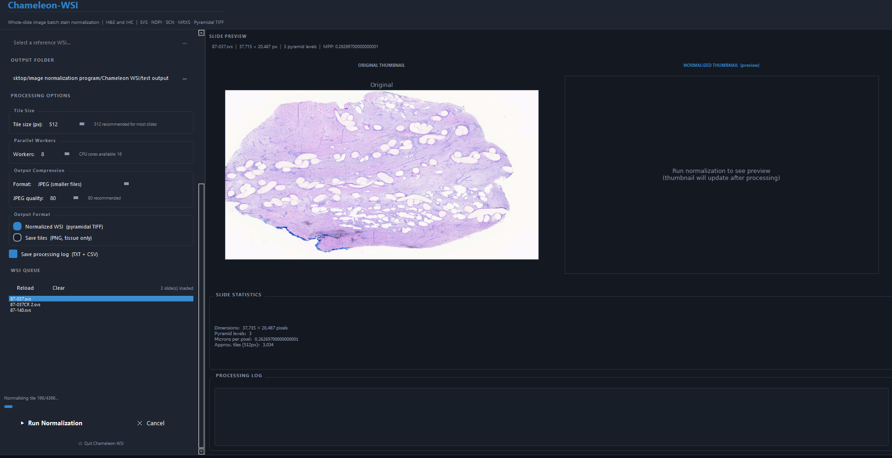
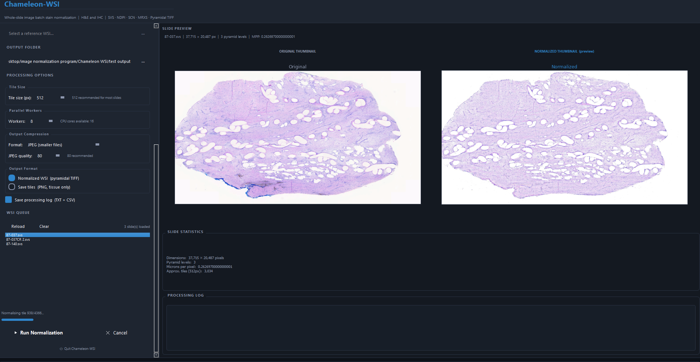

# Chameleon WSI

**A cross-platform stain normalization platform for whole slide histopathology images**

Chameleon WSI is a standalone desktop application for batch stain normalization of whole slide images (WSI) in digital pathology. It resolves inter-scanner and inter-laboratory color variability that degrades the performance of image analysis algorithms and deep learning models, with no programming experience required.

---

## Screenshots

### Main Window


### Slide Selected — Pre-Normalization


### Normalization Preview


---

## Features

- **Six validated normalization methods** covering the complete benchmark landscape
- **OpenSlide-compatible pyramidal TIFF output** with correct NewSubfileType IFD structure, multi-resolution levels, and preserved pixel spacing metadata
- **Automatic background detection** using perceptual LAB L\* lightness — correctly preserves pale eosin-stained tissue across varied staining intensities
- **Memory-efficient pipeline** — peak RAM stays flat on slides exceeding 1 billion pixels
- **Tile-save mode** for direct neural network input as coordinate-named PNG files
- **Dual log output** — human-readable TXT audit log and machine-readable CSV parameter file for full reproducibility
- **Before/after thumbnail preview** updates automatically after processing
- **TMA and biopsy** slide types supported with distinct tissue sampling strategies

---

## Normalization Methods

| # | Method | Reference | Description |
|---|--------|-----------|-------------|
| 1 | Histogram Matching | Reference slide | Matches per-channel intensity distributions to a chosen reference slide |
| 2 | Histogram Matching | Batch average | Builds a synthetic population-average histogram from all slides in the batch |
| 3 | Reinhard | Reference slide | Transfers LAB color statistics from a reference slide |
| 4 | Reinhard | Batch average | Computes mean LAB statistics across the batch as a synthetic reference |
| 5 | Macenko | Reference slide | Estimates H&E stain vectors via SVD — recommended for H&E tissue |
| 6 | Vahadane | Reference slide | Estimates stain vectors via sparse NMF — highest quality, structure-preserving |

Methods 5 and 6 are implemented without the SPAMS dependency using scikit-learn coordinate descent, allowing clean installation on Windows via pip.

---

## Supported Input Formats

| Format | Scanner |
|--------|---------|
| `.svs` | Aperio |
| `.ndpi` / `.ndpis` | Hamamatsu |
| `.scn` | Leica |
| `.mrxs` | 3DHistech |
| `.bif` | Ventana / Roche |
| `.tif` / `.tiff` | Generic pyramidal TIFF |
| `.dcm` | DICOM WSI (OpenSlide 4.0+) |

---

## Output Formats

### Pyramidal TIFF
Normalized slides are reconstructed as multi-resolution pyramidal TIFF files with sequential IFDs and `NewSubfileType` tags — the exact structure required by OpenSlide's generic-tiff reader. Output files open correctly in:
- QuPath
- Aperio ImageScope
- Bio-Formats / Fiji
- Any OpenSlide-compatible viewer

Resolution metadata (microns per pixel) is preserved exactly from the source slide.

### Tile Save Mode
Individual normalized tiles exported as PNG files into per-slide subfolders. Background tiles are automatically excluded. Filenames encode grid coordinates (`{slidename}_x{col:04d}_y{row:04d}.png`) for spatial reconstruction. Designed for direct input to deep learning segmentation and classification models.

---

## Installation

### Requirements

- Windows 10 / 11
- [Anaconda](https://www.anaconda.com/download) or Miniconda
- Python 3.9+

### Step 1 — Create environment and install Python dependencies

```bash
conda create -n chameleon_wsi python=3.10
conda activate chameleon_wsi
pip install pyqt5 openslide-python pyvips tifffile scikit-learn pillow numpy scipy
```

### Step 2 — Install OpenSlide Windows binaries

Download the OpenSlide Windows binaries from [openslide.org](https://openslide.org/download/) and place the DLL files in the `ChameleonWSI` folder alongside `run_chameleon_wsi.py`.

### Step 3 — Install libvips Windows binaries

Download the libvips Windows binary release from [github.com/libvips/build-win64-mxe](https://github.com/libvips/build-win64-mxe/releases) and place the contents of the `bin/` folder in the `ChameleonWSI` folder.

### Step 4 — Run

```bash
python run_chameleon_wsi.py
```

---

## Quick Start

1. **Load slides** — click **Browse** next to the input folder, or drag SVS/NDPI/TIFF files into the queue
2. **Select a method** — choose from the six normalization modes in the left panel
3. **Set a reference slide** — required for modes 1, 3, 5, and 6; click a slide in the queue and use **Set as Reference**
4. **Choose output format** — Pyramidal TIFF for WSI reconstruction, or Save Tiles for neural network input
5. **Set output folder** — click **Browse** next to the output path
6. **Run** — click **▶ Run Normalization** and monitor progress in the log panel

---

## Background Detection

Chameleon WSI uses the LAB L\* (perceptual lightness) channel to identify background pixels. Any pixel with L\* ≥ 88 is classified as background and written as pure white in the output without passing through the normalization algorithm.

This approach is more robust than simple RGB mean thresholding: pale pink eosin-stained tissue and near-white background can have similar RGB means but diverge in perceptual lightness space. The threshold is consistent with TIA Toolbox (L\*=80) and is applied uniformly across all six methods.

---

## Output Logs

When **Save processing log** is checked, two files are written to the output directory after each batch:

- `chameleon_wsi_run_log_{method}_{timestamp}.txt` — human-readable run summary with per-slide tile counts, processing times, and stain matrix values (Macenko/Vahadane)
- `chameleon_wsi_normalization_params_{method}_{timestamp}.csv` — machine-readable per-slide parameter log suitable for methods sections and supplementary tables

---

## File Structure

```
ChameleonWSI/
├── run_chameleon_wsi.py       # Launcher
├── chameleon_wsi_app.py       # PyQt5 GUI
├── chameleon_wsi_core.py      # WSI I/O, tile pipeline, pyramid assembly, logging
├── normalizer_core.py         # Normalization algorithms (Histogram, Reinhard, Macenko, Vahadane)
├── openslide-*.dll            # OpenSlide Windows binaries (user-provided)
└── vips-*.dll                 # libvips Windows binaries (user-provided)
```

---

## Technical Notes

### Pyramid Assembly
The three-stage assembly pipeline keeps peak RAM consumption flat regardless of slide size:
1. Normalize each tile and write to a temporary directory as individual uncompressed TIFFs (one tile in RAM at a time)
2. Stream level-0 tiles from disk into tifffile via an iterator, writing the full-resolution IFD
3. Open the written file with PIL (lazy, no pixels loaded) and call `PIL.reduce(factor)` to generate each sub-level, appending them to the file

### OpenSlide Compatibility
Output TIFFs use sequential top-level IFDs with `TIFFTAG_SUBFILETYPE` (tag 254) set to `FILETYPE_REDUCEDIMAGE` (1) on all reduced-resolution pages. This is the exact structure OpenSlide's `openslide-vendor-generic-tiff.c` requires to return `level_count > 1`.

### Vahadane Implementation
The Vahadane method is implemented using `sklearn.decomposition.DictionaryLearning` with `fit_algorithm='cd'` (coordinate descent) and `positive_code=True`, `positive_dict=True`. This replaces the SPAMS LARS-LASSO approach from the original paper, following the TIA Toolbox approach for cross-platform compatibility. OLS is used for concentration estimation.

---

## Dependencies

| Package | Purpose |
|---------|---------|
| PyQt5 | GUI framework |
| openslide-python | WSI file reading |
| pyvips | Image processing utilities |
| tifffile | Pyramidal TIFF writing |
| scikit-learn | Vahadane DictionaryLearning |
| Pillow | Tile I/O and pyramid sub-level generation |
| NumPy / SciPy | Numerical operations |

---

## Citation

If you use Chameleon WSI in your research, please cite:

```
Turner, N.J. (2025). Chameleon WSI: A Cross-Platform Stain Normalization Platform
for Whole Slide Histopathology Images. University of Pittsburgh, Department of Surgery.
https://github.com/neill-turner/chameleon-wsi
```

---

## License

MIT License — see [LICENSE](LICENSE) for details.

---

## Contact

**Neill Turner, PhD**  
Research Assistant Professor, Department of Surgery  
University of Pittsburgh  
neill.turner.phd@gmail.com  
[linkedin.com/in/neill-turner-b5908a65](https://linkedin.com/in/neill-turner-b5908a65)
